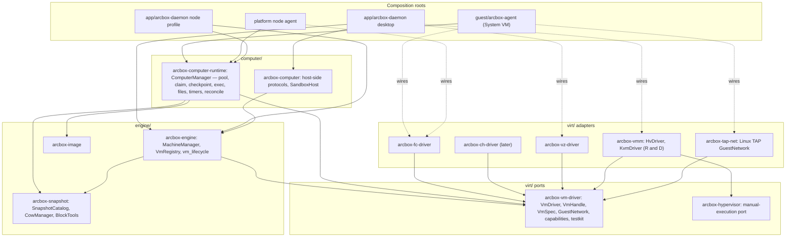

# VM Stack Redesign — the P4b execution design

Status: **locked** (2026-08-16; moved back from the company repo 2026-09-30). This is the execution design the charter
requires before P4b starts (`virt/arcbox-fc-driver` and the
`SandboxManager` redistribution), extended to the `arcbox-vmm`/engine
side so both VM orchestrators end up on one seam. Every restructure PR in
this area cites it; changes to the decisions below happen here first.

One-line shape: **one VM port, many VMM adapters, one computer runtime.**

## Summary

ArcBox has two VM orchestrators, each welded to one VMM. `arcbox-vm`'s
`SandboxManager` (13k lines) holds `fc_sdk::FirecrackerProcess` and
`Arc<fc_sdk::Vm>` as raw instance fields; `arcbox-engine`'s `VmManager`
holds `arcbox_vmm::Vmm`, a struct that dispatches on `VmBackend` across
three code paths (VZ, custom HV, KVM) behind 93 `target_os` gates. The
platform repo carries a third Firecracker module. Cloud Hypervisor for
Windows would be a fourth.

The redesign introduces exactly one new abstraction — a coarse,
object-safe **VM driver port** (`VmDriver` / `VmHandle`: boot, shutdown, events —
everything else, vsock, checkpoint/restore and adopt/detach included, is
a capability) — and moves every VMM behind it as an adapter: Firecracker
and Cloud Hypervisor as external processes, VZ as a managed VMM, our own
HV engine in-process. Both orchestrators consume the port. The sandbox
stack becomes a VMM-agnostic **computer runtime** with a pure lifecycle
core, unit-testable against a fake driver on any host; the engine loses
every `VmBackend` branch. Host-side pieces that differ per environment
(network attach, block tooling, packet filter, rootfs, agent channel)
stay behind the leaf ports CORE-127 already opened, and are wired once at
each composition root.

Scope: structure, not datapaths. SplitQueue, the HV workers,
`arcbox-net`, the vsock protocol and `arcbox.sandbox.v1` are untouched.
Perf guardrails are the existing e2e ladders on both backends and the
sandbox cold-start baselines.

## What exists today (facts at `master`, 2026-08-16)

| Component | Shape | Why it resists a second VMM |
|---|---|---|
| `virt/arcbox-vm` — 19.5k lines | `SandboxManager` across `sandbox.rs` + 15 files; `SandboxInstance { process: Option<fc_sdk::FirecrackerProcess>, vm: Option<Arc<fc_sdk::Vm>>, .. }`; Firecracker verbs called from `spawn.rs`, `boot.rs`, `checkpoint.rs`, `pause.rs`, `pool.rs`, `cleanup.rs`. | The verbs a VMM must provide are scattered across the flows and typed as `fc_sdk`. There is no narrow surface to lift out — the charter's own finding. |
| `virt/arcbox-vm/src/network` — 2.6k lines | `NetworkManager`: TAP ioctls, hand-encoded rtnetlink, eBPF NAT with iptables fallback, quarantine ledger, invariant translation. All Linux-gated. | Only a TAP-on-Linux implementation exists; the platform node's IPv6/eBPF datapath is a different one; VZ NAT and the HV socketpair datapath are others still. |
| `virt/arcbox-vmm` — 16.9k lines | `Vmm` struct: neutral core (memory, devices, IRQ, event loop, boot, snapshot) plus `darwin.rs` (VZ, 875), `darwin_hv/` (custom HV, 4.4k), `linux.rs` (KVM, 459). `initialize()` matches `VmBackend`. About 40 `Option<hv_*>` fields whose declaration order is load-bearing for `Drop`. | One type is three VMMs. Adding a fourth adds fields and cfgs to the same struct; the KVM path duplicates the HV boot path rather than sharing it. |
| `virt/arcbox-hypervisor` — 9.7k lines | Traits `Hypervisor`/`VirtualMachine`/`Vcpu`/`GuestMemory`. macOS impl is *VZ* (with a 674-line placeholder `DarwinVcpu`, since VZ is "managed execution"); Linux impl is KVM. The custom HV path bypasses it and uses `arcbox-hv` directly. | The trait is shaped for manual execution; VZ implements it by pretending. The one hypervisor that would fit (HV) does not use it. |
| `engine/arcbox-engine` | `VmManager { vmm: Option<Vmm> }`; `MachineManager::connect_agent` matches `VmBackend` to pick a blocking vs async agent transport; `VmLifecycleManager` is a statig HSM + actor + effects (the good pattern in the tree). | Backend selection leaks into transport choice and into `arcbox-computer` (`nested_virt_for_backend(VmBackend)`). |
| `../platform bins/arcbox-agent` | Own Firecracker module (~2.1k non-test lines) with internal `VmRuntime`/`NetworkManager` traits and fakes; IPv6-only TAP + eBPF; no jailer, no snapshot, no guest agent. | A second copy of "drive Firecracker" with none of the sandbox semantics. |

Two smaller facts matter for naming: `arcbox_vm::VmmConfig` and
`arcbox_vmm::VmmConfig` are different types with the same name; and
`arcbox_vmm::snapshot::SnapshotManager` and
`arcbox_snapshot::SnapshotCatalog` are two snapshot stores.

## Patterns as rules

Each pattern becomes one rule the code is held to. The rest of the
document is these rules applied.

| Pattern | Rule here | Enforced by |
|---|---|---|
| Ports & adapters | A port is defined by its consumer, in the consumer's vocabulary, below every adapter in the dependency graph. Adapters depend on the port; orchestrators depend on the port; nobody depends on an adapter except a composition root. | `cargo xtask check-layers` (reads `cargo metadata`; fails on a forbidden edge) |
| Composition root | Concrete adapters are chosen in exactly four places: the guest agent, the desktop daemon, the daemon's node profile, the platform node agent. Libraries never branch on "which environment am I in". | No `VmBackend` match and no `cfg(target_os)` outside `virt/` adapters and roots |
| Template method + capability traits | The orchestration sequence is written once; what varies is behind the driver. Optional features are capability traits reached through `Option<&dyn Cap>` accessors — never a method that returns `Unsupported`. | Port trait shape; a stub-returning method fails review |
| Functional core, imperative shell | Decisions are pure and pinned by tests: spec rendering, rule rendering, lifecycle transitions, pool policy, reconcile diffs, timer arithmetic. I/O lives in effect interpreters and adapters. | Unit tests run on macOS without KVM; the runtime's tests use `FakeDriver` |
| Role interfaces + fakes + contract tests | Every port ships a fake and a contract test-kit; every adapter runs the contract in its own (ignored) e2e. Consumers who need less define a narrower trait on their side. | `testkit` feature on the port crate; adapter e2e jobs |
| Data vs behavior | If it can be written in a TOML file it is config (`VmSpec`, `RuntimeConfig`, `DriverConfig`); if it needs code it is environment (`NodeEnvironment`). Never a string that names an implementation. | Type shapes; serde on data, `Arc<dyn>` on behavior |
| RAII / scope guards | Host resources (processes, leases, loop devices, mounts) are guards with explicit `commit`/`release`; `Drop` is the fallback that cannot report — so any path that must report cleanup failure keeps an explicit sequence. | Guard types in adapters; explicit teardown in the runtime |

## Target architecture



Arrows are compile-time dependencies; dotted arrows are the wiring a root
performs. Two properties hold by construction: no crate in `engine/` or
`computer/` depends on an adapter, and every adapter is reachable from at
least one root.

## The port: `arcbox-vm-driver`

A small crate: the vocabulary of "a VM on this host" and nothing else.
Dependencies: `tokio`, `async-trait`, `serde`, `thiserror`. No arcbox
crate. The traits are object-safe on purpose — roots store
`Arc<dyn VmDriver>` and orchestrators store `Box<dyn VmHandle>`.

```rust
// virt/arcbox-vm-driver/src/lib.rs (shape; doc comments elided)

pub struct VmSpec {                                  // data — serde
    pub id: VmId,
    pub cpus: u32,
    pub memory_mib: u32,
    pub boot: BootSpec,                              // Kernel{image,cmdline,initrd} | Firmware{image} | MacOs{aux_storage,hardware_model,machine_id}
    pub disks: Vec<DiskSpec>,                        // { id, path, read_only, root, cache: CacheMode }
    pub nics: Vec<NicSpec>,                          // { id, mac, attachment: NicAttachment }
    pub vsock: Option<VsockSpec>,                    // { guest_cid }
    pub shares: Vec<ShareSpec>,                      // virtiofs { tag, host_path, read_only }
    pub console: ConsoleSpec,                        // Off | File(path) | Socket(path)
    pub balloon: bool,
    pub entropy: bool,
    pub dirty_tracking: bool,
    pub isolation: IsolationSpec,                    // None | Jailer { uid, gid, chroot_base, netns, new_pid_ns, cgroup }
}
pub enum NicAttachment { Tap { name: String }, HostNat /* the driver's own host-side NAT */, FileHandle { fd: i32 /* process-local, borrowed for the boot call; VmRecord is the durable identity */ }, Bridge { interface: String } }

#[async_trait]
pub trait VmDriver: Send + Sync {
    fn name(&self) -> &'static str;
    fn capabilities(&self) -> DriverCapabilities;   // { vsock, vsock_listen, checkpoint, diff_checkpoint, adopt, prepare, balloon, console, debug, nested_virt: NestedVirt }
    async fn boot(&self, spec: VmSpec, runtime_dir: &Path) -> Result<Box<dyn VmHandle>>;
    async fn restore(&self, image: &CheckpointImage, spec: RestoreSpec, runtime_dir: &Path) -> Result<Box<dyn VmHandle>>;   // RestoreSpec { id, nics, isolation, disks } — disks at their host paths for THIS restore
    fn adopt(&self) -> Option<&dyn Adopt>;           // capability: VMs that outlive this process (external-process VMMs only)
    fn prepare(&self) -> Option<&dyn Prepare>;       // capability: spawn the VMM ahead of a boot; boot == prepare-then-boot (contract-tested)
}

#[async_trait]
pub trait VmHandle: Send + Sync {
    fn id(&self) -> &VmId;
    fn record(&self) -> VmRecord;                    // durable identity: pid/api socket/dirs for external VMMs; what `Adopt` consumes
    fn state(&self) -> VmState;                      // Running | Quiesced | Exited(ExitStatus)  — Quiesced only via Checkpoint{hold}
    fn events(&self) -> broadcast::Receiver<VmEvent>;// Exited(status) | ResetRequested
    async fn shutdown(&self, mode: ShutdownMode) -> Result<ExitStatus>;   // Graceful{timeout} | Kill; Drop = Kill unless detached

    fn vsock(&self) -> Option<&dyn Vsock>;            // capability accessors — None when the spec had no vsock device or the VMM has none
    fn checkpoint(&self) -> Option<&dyn Checkpoint>;
    fn detach(&self) -> Option<&dyn Detach>;          // present iff the driver has `Adopt`
    fn vsock_listener(&self) -> Option<&dyn VsockListen>;
    fn balloon(&self) -> Option<&dyn Balloon>;
    fn console(&self) -> Option<&dyn Console>;
    fn debug(&self) -> Option<&dyn DebugSnapshot>;
}

#[async_trait] pub trait Checkpoint  {                // quiescing is the capability's own business: no pause/resume on the handle
    async fn checkpoint(&self, dst: &Path, opts: CheckpointOptions) -> Result<CheckpointImage>;   // opts.after: Resume | HoldQuiesced
}
#[async_trait] pub trait Vsock       { async fn dial(&self, port: u32) -> Result<VsockConn>; }   // VsockConn { fd: OwnedFd, mode: IoMode }
#[async_trait] pub trait Adopt       { async fn adopt(&self, record: &VmRecord) -> Result<Option<Box<dyn VmHandle>>>; }   // Ok(None) = nothing survived (a legitimate outcome, not absence of the capability)
#[async_trait] pub trait Detach      { async fn detach(&self) -> Result<VmRecord>; }              // leave the VM running; from here on Drop no longer kills
#[async_trait] pub trait Prepare     { async fn prepare(&self, id: &VmId, isolation: &IsolationSpec, runtime_dir: &Path) -> Result<Box<dyn PreparedVm>>; }
#[async_trait] pub trait PreparedVm  {                // a spawned VMM waiting for a spec: pid/api socket known, READY listener bindable before the guest starts
    fn id(&self) -> &VmId; fn record(&self) -> VmRecord; fn alive(&self) -> bool;
    fn vsock_listener(&self) -> Option<&dyn VsockListen>;
    async fn boot(&self, spec: VmSpec) -> Result<Box<dyn VmHandle>>;
    async fn restore(&self, image: &CheckpointImage, spec: RestoreSpec) -> Result<Box<dyn VmHandle>>;
    async fn discard(&self) -> Result<ExitStatus>;   // kill + reap now; idempotent; Drop kills unless a boot/restore succeeded
}
#[async_trait] pub trait VsockListen { async fn listen(&self, port: u32) -> Result<VsockListener>; }
#[async_trait] pub trait Balloon     { async fn set_target(&self, bytes: u64) -> Result<()>; async fn stats(&self) -> Result<BalloonStats>; }
pub trait DebugSnapshot { fn snapshot(&self) -> VmDebugSnapshot; }

pub mod net {                                        // the second port, same crate: what a VM is attached to
    #[async_trait]
    pub trait GuestNetwork: Send + Sync {
        async fn reserve(&self, vm: &VmId, policy: NetworkPolicy) -> Result<NetworkLease>;   // address + host resources planned
        async fn activate(&self, lease: &NetworkLease, mode: AttachMode) -> Result<NicSpec>;   // TAP created, filters installed
        async fn quarantine(&self, lease: NetworkLease) -> Result<()>;                          // idempotent teardown into the ledger
        async fn release(&self, lease: NetworkLease) -> Result<()>;
        fn identity(&self, lease: &NetworkLease) -> NetworkIdentity;                              // guest ip/gateway/dns/mac as the guest sees them
        fn reconcile(&self) -> Option<&dyn NetworkReconcile>;                                    // capability: startup sweep + cleanup-token protocol
    }
}

pub mod testkit {                                    // feature = "testkit"
    pub struct FakeDriver;                           // in-memory VMs: state machine, events, scripted failures, fake vsock via socketpair
    pub struct FakeNetwork;
    #[macro_export] macro_rules! driver_contract { ($mk:expr) => { /* boot→dial→checkpoint(Resume)→checkpoint(HoldQuiesced)→shutdown→restore→dial; detach→adopt round-trip when Adopt is present; capabilities() agrees with the accessors; event ordering */ } }
}
```

Why these verbs and no others:

- They are the union of what the two orchestrators call today:
  `SandboxManager` uses spawn (direct/jailer), API socket, pid, wait,
  SIGKILL, boot source + machine config (with `track_dirty_pages`),
  drive/NIC/vsock attach, start, pause, resume, full `create_snapshot`,
  `restore` with per-NIC overrides; `VmManager` uses
  start/stop/pause/resume/reboot, balloon target/stats, debug snapshot,
  console read, vsock connect, snapshot capture/restore. Nothing else
  appears (no diff snapshot call site, no MMDS, no rate limiters, no
  metrics readback).
- Pause and resume are *not* handle verbs. Every production call of
  VMM-level pause/resume today sits inside checkpoint or restore
  mechanics — `checkpoint.rs:149/195` and the revert at `pause.rs:213` in
  `arcbox-vm`, `vm.rs:652/661` (capture) and `:784/790` (apply) in the
  engine; the engine's public `VmManager::pause/resume` have no callers.
  Quiescing is therefore the `Checkpoint` capability's own business
  (`CheckpointOptions::after = Resume | HoldQuiesced`; the runtime's
  computer-level pause is checkpoint-with-hold followed by
  `shutdown(Kill)`, its resume is `restore`). Keeping the verbs off the
  handle also ends the name collision between the runtime's
  `pause_sandbox` (checkpoint + release) and a VMM freeze. A VMM that can
  freeze without checkpointing (VZ) gets a `Suspend` capability the day a
  consumer exists, not before.
- `Prepare`/`PreparedVm` exist because an external-process VMM is
  two-phase: a warm pool pre-spawns the jailer long before a boot, the pid
  is journaled before any guest runs, a boot can be killed mid-staging,
  and the READY vsock listener must be bound while nothing can race it.
  In-process VMMs return `None`; `boot` is contractually
  prepare-then-boot, so a plain boot never sees the split. (Added during
  R0 from the R1 seam map, 2026-08-16.)
- `Adopt`/`Detach` are a capability pair, present only on
  external-process VMMs (FC, CH): the platform agent already re-adopts
  orphaned Firecracker processes after its own restart and cocoon's
  crash-convergence pattern is on the borrow list. For an in-process VM
  (VZ, HV) "leave it running and give up ownership" has no meaning — the
  VM dies with the daemon — so a mandatory `detach` would silently mean
  `shutdown(Kill)` there; the accessor returns `None` instead. Inside the
  capability, `adopt → Ok(None)` keeps its meaning of "nothing survived"
  (stale record, dead pid), which is an outcome, not an absence.
- vsock is a capability, not a handle verb. `VmSpec.vsock` is already
  `Option`, so a handle for a VM booted without the device has nothing to
  dial; and a VMM/guest pair may have no vsock at all (a Windows guest has
  no in-box virtio-vsock driver — its agent transport is the NIC). A
  mandatory `dial_vsock` would be exactly the stub-returning method the
  port forbids. The runtime's `GuestAgent` port is where the transport is
  chosen: `VmProtoAgent` over `Vsock::dial` today, a
  TCP-on-`NetworkIdentity` agent for guests without vsock later; the
  engine's `connect_agent` requires the capability and reports its
  absence as a configuration error, not a runtime surprise. The mandatory
  core of `VmHandle` is therefore only: identify (`id`/`record`), observe
  (`state`/`events`), and stop (`shutdown`; `Drop` kills unless a `Detach`
  released it).
- `VsockConn::mode` carries the one transport fact that today lives in a
  `VmBackend` match: the HV socketpair stalls the kqueue reactor under
  rapid connect/teardown, so `HvDriver` hands back `IoMode::Blocking`;
  every other adapter hands back `Async`. The engine builds `AgentClient`
  from the conn and never asks which backend it is.
- `VmSpec` is per-VM shape and serializable. Node-wide knobs — binary
  paths, seccomp, log level, jailer defaults, MTU — are `DriverConfig` on
  the adapter's constructor. That is the data/behavior split applied
  inside the port: both are data, but they belong to different owners.

Relation to charter D2: D2's clarification said the FC driver is not a
`Hypervisor` impl and a shared external-VMM trait should wait for a
second external VMM. Cloud Hypervisor is now on the roadmap for Windows,
and VZ/HV expose the same coarse verbs, so the shared trait pays for
itself — as a *new* coarse port, not by widening `arcbox-hypervisor`.
Nothing external ever implements `Hypervisor`.

## Adapters

### `virt/arcbox-fc-driver` — Firecracker

Extracted from `arcbox-vm`: `spawn.rs`, the `VmBuilder` block in
`boot.rs`, the pause/snapshot/restore call sites in
`checkpoint.rs`/`pause.rs`, pid/wait/kill in `cleanup.rs`/`pool.rs`, and
the vsock UDS `CONNECT` handshake from `vsock.rs`.

- `render::fc_config(&VmSpec, &DriverConfig) -> FcPlan` is a pure
  function producing the exact `fc_sdk::types` payloads and
  chroot-relative paths; pinned by tests the way `translation_rules` is.
  Jailer path relativity ("every path the FC API sees is chroot-relative")
  lives here and nowhere else.
- `ProcessGuard` wraps `FirecrackerProcess`: kills and reaps on drop
  unless `commit()`ed into an `FcHandle`; `FcHandle::detach()` hands the
  process to the record. Staged files (kernel, rootfs, vmstate) are
  `StagedFile` guards with the same discipline.
- `Adopt::adopt` verifies `/proc/<pid>/cmdline` against the recorded API
  socket, reconnects, and rebuilds the handle — the platform agent's
  `AdoptedVmProcess`, generalized; `Detach` flips the process guard so
  `Drop` stops killing.
- `Checkpoint` capability: pause → `create_snapshot` → resume, or stay
  quiesced under `after: HoldQuiesced` (today's `resume_after = false`);
  diff snapshots are declared unsupported until a consumer exists
  (`DriverCapabilities.diff_checkpoint = false`).
- `VsockListen`: binds `{uds}_{port}`, which is what the guest's READY
  dial-out uses today.

### `virt/arcbox-vz-driver` — Virtualization.framework

Extracted from `arcbox-vmm/src/vmm/darwin.rs` plus the VZ device
configuration that `arcbox-hypervisor/src/darwin` performs today. Depends
on `arcbox-vz`, `arcbox-net`, `arcbox-vm-driver`. It renders `VmSpec`
into `VirtualMachineConfiguration`, owns the NAT/file-handle NIC creation
and the vmnet bridge NIC, exposes `Balloon`, `Console`, and `Vsock`
(Async). `Checkpoint` is `None` until `saveMachineStateTo` is bound in
the shim — a stated gap, not a stub. `BootSpec::MacOs` makes the
macOS-guest path (`MacMachineManager`) a spec variant instead of a
parallel manager.

### `virt/arcbox-vmm` — the in-process engine, and `HvDriver`

The crate keeps what only it can do: build a VMM from parts. Structure
changes, datapath does not:

- `Vmm` splits into `HvMachine` (macOS: guest RAM, `HvVm`, GIC, device
  manager, vCPU threads, blk/net/vsock/console workers, DAX mappers,
  balloon, PSCI power) and `KvmMachine` (Linux, R&D). Each is a plain
  struct whose field order and explicit `stop()` encode the teardown
  contract that `lifecycle.rs` documents (join vCPUs → join workers
  holding `GuestMemWriter` → DAX drain → GIC → VM → guest memory). The 93
  cfgs collapse to two module gates.
- The neutral core stays as the library the machines are built from:
  `MemoryManager`, `DeviceManager`, `IrqChip`, `EventLoop`, `boot`/`fdt`,
  workers, `vcpu_stats`.
- The async-worker completion contract (trigger_interrupt → irq_callback
  → exit_vcpus) becomes one method, `DeviceManager::complete_io(device)`,
  that every worker calls. The three steps cannot be reordered or dropped
  by a new worker. `complete_io` covers the async workers only — the
  vCPU-thread sites (`sync_irq_level`, `raise_interrupt_for_device`) stay
  two-step because the vCPU is already out of WFI — and it *calls* the
  `exit_vcpus` closure rather than counting: `hv_kick_broadcasts` keeps
  being incremented inside `make_exit_vcpus_fn`, after its empty-registry
  early return, so the R2/R3 counters stay byte-identical (R4 seam map,
  2026-08-17).
- `HvDriver: VmDriver` renders `VmSpec` into today's `VmmConfig` (a pure
  `render`, tested), boots an `HvMachine`, and returns it as a `VmHandle`:
  `Vsock::dial` is the socketpair injection (`IoMode::Blocking`), `Balloon`
  is the HV balloon, `DebugSnapshot` is `debug_snapshot()`, `Console`
  reads the console ring. `Checkpoint` is **absent**: `Vmm::capture_snapshot_context`
  answers `Unsupported("snapshot capture is not yet implemented for the HV
  backend")` today, so there is nothing to put behind the capability and
  `capabilities().checkpoint` is false — a stated gap, not a stub (R4 seam
  map, 2026-08-17). `set_balloon_target`'s off-macOS `Unsupported` stub
  disappears — the capability accessor returns `None`.
- `arcbox_vmm::snapshot` (the JSON+LZ4 store) retires in favor of
  `arcbox_snapshot::SnapshotCatalog`; `VmSnapshotContext`/`VmRestoreData`
  become `HvMachine` internals behind `Checkpoint`. The Linux `criu`
  module has no consumer and goes with the `runtime/` decision in the
  charter.
- `VmBackend` leaves this crate (see the engine section).

### `virt/arcbox-ch-driver` — Cloud Hypervisor (later)

Same shape as the FC driver: a pure `render` to CH's `VmConfig`, a
process guard, the CH API for snapshot/restore (pause/resume inside
`Checkpoint`), `BootSpec::Firmware` for UEFI Windows. It starts when Windows work
starts; the port is designed so it adds a crate and a root wiring line,
nothing else.

## `arcbox-hypervisor`, narrowed

`arcbox-hypervisor` becomes what its trait already describes: the
manual-execution port (`create_vm`, `create_vcpu`, `run`, `GuestMemory`,
dirty tracking, per-device snapshots) consumed only by `arcbox-vmm`.
Consequences:

- The VZ implementation under `src/darwin` (with the placeholder
  `DarwinVcpu`) is deleted once `arcbox-vz-driver` serves the engine; VZ
  is a managed VMM and belongs behind `VmDriver`.
- `host_nested_virt` / `PlatformCapabilities` fold into
  `DriverCapabilities.nested_virt`: `VzDriver` probes VZ, `HvDriver`
  answers false, `FcDriver` reads the KVM nested parameter.
  `arcbox_computer::capability` takes a `&dyn VmDriver` and the
  `VmBackend` import leaves the computer layer.
- `arcbox-hv` implements the port *only* when the in-process KVM engine
  leaves R&D and the HV/KVM boot paths are unified over it. Until then
  `darwin_hv` keeps using `arcbox-hv` directly; the trigger is stated so
  this is a decision, not an open item.

## `GuestNetwork` and `arcbox-tap-net`

`arcbox-vm/src/network/*` moves to `virt/arcbox-tap-net` as the Linux TAP
adapter of `GuestNetwork`: address pool, TAP ioctls, hand-encoded
rtnetlink (pure encoders, tested), eBPF NAT engine, iptables fallback,
quarantine ledger and startup-cleanup token protocol (as the
`NetworkReconcile` capability), and the CORE-127 `PacketFilter` port with
`IptablesLegacy` beneath it. `invariant::GUEST_IP` and friends stay
exported for the guest agent's port-forward and init code, which are
System-VM specifics wired at that root.

Other adapters exist without new code in the runtime: the platform's
`DataplaneNetworkManager` (IPv6 /128 + eBPF, no NAT) implements
`GuestNetwork` in the platform repo; VZ NAT and the HV socketpair
datapath are attachments the VZ/HV drivers create from
`NicAttachment::HostNat` / `FileHandle`, with a trivial `GuestNetwork`
that only mints MACs.

## The computer runtime: `computer/arcbox-computer-runtime`

The successor of `arcbox-vm`'s `SandboxManager`: the VMM-agnostic
lifecycle of computers on a node — pool, claim, boot, ready gate,
workload, exec, files, pause/resume, checkpoint/restore, templates,
timers, cleanup, reconcile, durable records. Same public verbs, three
structural changes.

Ports it consumes (all injected):

```rust
pub struct NodeEnvironment {                          // behavior — grows out of today's SandboxEnvironment
    pub driver:  Arc<dyn VmDriver>,
    pub network: Arc<dyn GuestNetwork>,
    pub block_tools: Arc<dyn BlockTools>,             // arcbox_snapshot (CORE-127)
    pub rootfs:  RootfsBuilder,                       // CORE-127; paths supplied by the root
    pub agent:   Arc<dyn GuestAgentFactory>,          // VmProtoAgent by default (vsock frames of arcbox-vm-proto)
    pub clock:   Arc<dyn Clock>,                      // timers, TTL — fake in tests
}
pub struct RuntimeConfig { data_dir, network: NetworkConfig, defaults: DefaultComputerConfig, pool: PoolConfig, jailer: Option<JailerPolicy>, dmsetup_candidates, .. }   // data — today's arcbox_vm::VmmConfig, renamed
impl ComputerManager {
    pub fn new(config: RuntimeConfig, env: NodeEnvironment) -> Result<Self>;
    pub fn into_shared(self) -> Arc<Self>;
    // create/replay, stop, remove, inspect, list, subscribe_events, pause, resume, checkpoint, restore, list/delete checkpoints,
    // executions (start/attach/stdin/signal/resize/wait/list), files (8 verbs), templates (8 verbs), lifecycle timers,
    // run_in_computer, network identity, cleanup-token protocol, shutdown — same signatures as SandboxManager today
}
```

Pure core:

- `lifecycle::ComputerLifecycle` — a statig HSM exactly like
  `vm_lifecycle/machine.rs`: states `Provisioning → Booting →
  Ready{Warm|Claimed} → Running → Pausing → Paused → Resuming →
  Checkpointing → Stopping → Stopped | Failed`; events from the API, from
  `VmEvent`, from timers; effects `SpawnBoot, SpawnRestore,
  SpawnCheckpoint, ReleaseResources, PersistPhase, ArmTimer, Publish`.
  Transition tables are unit tests. The durable record store
  (`SandboxRecordStore`, unchanged) is written by the `PersistPhase`
  interpreter, so today's crash-safe phases are preserved by
  construction.
- `pool::Policy` (already generic `SlotPool<T>`), `warm::derive_warm_key`,
  `reconcile::plan(records, observed) -> Vec<Action>`, `timers` deadlines
  — pure, and the places where cocoon's watermark/EWMA and
  crash-convergence rules land later without touching I/O.

Imperative shell:

- One actor per computer (mpsc commands, effects interpreted with the
  environment's ports), replacing the per-instance
  `cleanup_lock`/`boot_task` fields and `RwLock<HashMap>` flows. Slow
  work (boot, checkpoint, restore) runs in preemptible sub-tasks so
  remove/force-stop can preempt, mirroring the engine actor.
- Readiness gate: `vsock_listener(READY_PORT)` when the handle has
  `VsockListen`, else poll `Vsock::dial(AGENT_PORT)`, else the
  `GuestAgent`'s own probe (a guest without vsock is reached over whatever
  transport the root's agent factory supplies) — capability with
  fallback, decided once in the sequence.
- Guards: `NetworkLease` (quarantine on drop unless released),
  `LoopDevice`/`Mount` in the rootfs builder, `ProcessGuard` inside the FC
  driver. Teardown paths that must report failure keep the explicit
  collect-all sequence the CORE-127 reviews settled on.

Naming: "Computer" enters at this layer (charter D5): `ComputerManager`,
`ComputerSpec`, `ComputerId`, `ComputerState`, `ComputerEvent`.
`pub type SandboxManager = ComputerManager` and sibling aliases keep
`guest/arcbox-agent` compiling until it migrates (D6).
`arcbox_vm::VmmConfig` becomes `RuntimeConfig`, ending the name clash
with `arcbox_vmm::VmmConfig`. The `arcbox-vm` crate is deleted at the
end; `arcbox-vm-proto` and `arcbox-vm-agent` keep their names (the agent
that runs *inside* a VM).

## The engine over the same port

- `VmManager` becomes `VmRegistry { entries: RwLock<HashMap<VmId,
  VmEntry { config, handle: Option<Box<dyn VmHandle>> }>> }` over a
  `DriverRegistry: HashMap<VmBackend, Arc<dyn VmDriver>>` supplied by the
  root. `build_vmm_config` becomes `VmConfig → VmSpec` (pure). Balloon,
  debug, console, snapshots go through capabilities.
- `VmBackend` moves to `arcbox-engine` as a config enum (persisted in
  `system-vm.toml`, chosen by `abctl system backend`) whose only consumer
  is the registry lookup. `supports_nested_virt` leaves it — that is
  `DriverCapabilities`.
- `MachineManager::connect_agent` loses its `VmBackend` match:
  `AgentClient::from_conn(cid, handle.vsock().ok_or(no_vsock)?.dial(port).await?)`
  picks the transport from `VsockConn::mode`. `agent_client::is_blocking()` stays
  as the consumer-side fact it already is.
- `VmLifecycleManager`, its HSM, boot sub-tasks, balloon controller and
  `BalloonDeps` are unchanged; `RealBalloonDeps` calls the `Balloon`
  capability. `reclaim_capable` stays false on both macOS drivers for the
  measured reasons in `balloon/mod.rs`.
- Machine snapshots use `arcbox_snapshot::SnapshotCatalog`. The engine's
  own VM-snapshot surface (`VmManager::{create,restore,list,prune,delete}`)
  turned out to be callerless — every snapshot RPC goes to the sandbox
  path — so R4 deletes it rather than porting it, and `EngineError::Snapshot`
  (never constructed, never matched) goes with it; a future engine-side
  checkpoint adds the dependency and the variant back together (R4 seam
  map, 2026-08-17).

## Composition roots

| Root | VmDriver | GuestNetwork | BlockTools / PacketFilter | Paths & agent |
|---|---|---|---|---|
| `guest/arcbox-agent` — System VM (today's sandbox shape) | `FcDriver` jailer mode (uid 0, `/srv/jailer`) | `arcbox_tap_net::TapNetwork` with eBPF, iptables fallback | `BusyboxBlockTools` / `IptablesLegacy` | `/arcbox/bin/vm-agent`, `/arcbox/bin/dmsetup` first, `/var/lib/arcbox/sandbox`; `VmProtoAgent` |
| `app/arcbox-daemon` desktop (macOS) | `VzDriver` and `HvDriver` in the registry; selection by `VmBackend` | NAT / vmnet bridge inside the drivers | n/a (no CoW rootfs on the host) | engine `MachineManager`; sandboxes stay inside the System VM |
| `app/arcbox-daemon` node profile (bare Linux, charter P5) | `FcDriver` direct or jailer per config | `TapNetwork` | `UtilLinuxBlockTools` / `Nftables` — the consumer's few dozen lines | distro paths from config; `VmProtoAgent` |
| `../platform bins/arcbox-agent` — cloud node | `FcDriver` direct; later `ChDriver` for Windows | its `DataplaneNetworkManager` as a `GuestNetwork` impl (IPv6, no NAT) | loop ioctls or util-linux / none | `/srv/firecracker/*`; runenv squashfs is a `DiskSpec`; exec/files require `vm-agent` in its images |
| Apple-hardware node (later) | `VzDriver` with `BootSpec::MacOs` | VZ NAT | n/a | needs vsock attach + a macOS in-guest agent — see Deferred |

The platform agent keeps its gRPC `AgentService`; its
`VmRuntime`/`FakeRuntime` and `NetworkManager` traits retire in favor of
`VmDriver`/`FakeDriver` and `GuestNetwork`. Its template cache and bake
pipeline stay its own until `arcbox-image` grows an OCI→ext4 story.

## Testing

- **Runtime unit tests run anywhere.** `arcbox-computer-runtime`'s tests
  build a `ComputerManager` over `FakeDriver`+`FakeNetwork`+`MemBlockTools`
  +a fake clock and drive create/claim/pause/checkpoint/restore/timeout/
  crash paths through the real actor and HSM. This replaces the
  `insert_instance`/`instance_map` test-only constructors and the two
  `cfg(test)` timeout overrides in `cleanup.rs` (the fake clock makes them
  unnecessary). This is the cocoon `fakeEngine` e2e shape.
- **Adapters run the contract.** `driver_contract!` is instantiated in
  `arcbox-fc-driver`'s e2e (test-vm-linux, real KVM), in
  `arcbox-vz-driver`'s and `arcbox-vmm`'s macOS e2e (`backend_matrix`). A
  driver that cannot pass the contract cannot claim the capability.
- **Existing ladders are the oracle.** test-vm-linux's four jobs,
  `sandbox` e2e with its cold-start baselines, `boot_assets`/`virtio_debug`
  on both macOS backends, `backend_matrix`. VZ remains the oracle backend
  for HV.
- **Layer rules are checked, not remembered.** `cargo xtask check-layers`
  reads `cargo metadata` and fails CI when `engine/`, `computer/`, or a
  port crate depends on an adapter or a macOS-only crate, and when a
  computer crate depends on `arcbox-vmm`/`arcbox-hypervisor`.

## Pattern map

| Element | Pattern | What it prevents |
|---|---|---|
| `VmDriver`/`VmHandle` in `arcbox-vm-driver` | Port (ports & adapters); coarse verbs = template method's hooks | A fourth copy of "drive a VMM"; orchestrators typed on `fc_sdk`/`Vmm` |
| `Option<&dyn Vsock>`, `Checkpoint`, `Balloon`, `VsockListen`, `Adopt`/`Detach` | Capability traits (cocoon's optional interfaces) | God trait with `Unsupported` stubs consumers must guess about |
| `render::fc_config`, `render::vmm_config`, `translation_rules`, HSM tables, pool policy, reconcile plan | Functional core | Behavior that only a KVM box can test; jailer path rules scattered across flows |
| `ComputerLifecycle` statig HSM + effects interpreter | Functional core / imperative shell; state machine as the one place transitions are legal | Ad-hoc state writes racing durable records |
| `NodeEnvironment`, `DriverRegistry`, four roots | Composition root / DI | Libraries that know they run in the System VM |
| `VmSpec`/`RuntimeConfig`/`DriverConfig` vs `NodeEnvironment` | Data vs behavior | Config strings naming implementations; environment objects full of paths |
| `FakeDriver`, `FakeNetwork`, `driver_contract!`, `testkit` feature | Role interfaces + fakes + contract tests | `cfg(test)` seams that vanish on extraction; adapters that drift from the contract |
| `ProcessGuard`, `NetworkLease`, `LoopDevice`, `Mount`, `HvMachine` field order | RAII / scope guards | Leaked processes/TAPs/loops on early return; teardown-order regressions (ABX-415 class) |
| `DeviceManager::complete_io` | Template method for the completion contract | A worker that forgets `exit_vcpus()` (intermittent WFI hangs) |
| `VsockConn::mode` | Platform difference stops at the adapter | `VmBackend` matches in transport code |
| `SandboxHost` (unchanged), platform's narrow node interface | Consumer-defined role interface | A giant exported trait mirroring the manager |

## Locked decisions

- **D-VM1** One VM port: `virt/arcbox-vm-driver` with object-safe
  `#[async_trait]` traits `VmDriver`, `VmHandle`, `GuestNetwork`.
  `VmHandle`'s mandatory surface is identify / observe / stop; vsock,
  checkpoint, listen, balloon, console, debug, and the adopt/detach pair
  are capabilities via
  `Option<&dyn Cap>` accessors, and `capabilities()` must agree with the
  accessors (contract-tested); no method may return an "unsupported"
  error as its normal answer.
- **D-VM2** Adapters: `arcbox-fc-driver` (external), `arcbox-ch-driver`
  (external, when Windows starts), `arcbox-vz-driver` (managed),
  `arcbox-vmm::HvDriver` (in-process), `arcbox-vmm::KvmDriver`
  (in-process, R&D). None of FC/CH/VZ implements
  `arcbox_hypervisor::Hypervisor`. This supersedes the "wait for a second
  external VMM" clause of charter D2.
- **D-VM3** `arcbox-hypervisor` is the manual-execution port only,
  consumed by `arcbox-vmm`. Its VZ implementation is deleted once
  `arcbox-vz-driver` serves the engine. `arcbox-hv` implements it only
  when the KVM engine leaves R&D and the two boot paths are unified over
  it.
- **D-VM4** Data vs behavior: `VmSpec`, `RuntimeConfig`, `DriverConfig`
  are serde data; `NodeEnvironment` is behavior. `VmBackend` is an
  engine-owned config enum resolved to a driver only in composition
  roots. No `VmBackend` match and no `cfg(target_os)` in `computer/`;
  `cargo xtask check-layers` enforces the dependency half in CI.
- **D-VM5** One computer runtime, `computer/arcbox-computer-runtime`,
  succeeding `arcbox-vm`'s `SandboxManager`: statig HSM + per-computer
  actor + effects; pure policy modules; unit tests over `FakeDriver` on
  any host. Public verbs preserved 1:1; "Computer" names with `Sandbox*`
  aliases until `guest/arcbox-agent` migrates; `arcbox-vm` deleted at the
  end.
- **D-VM6** `GuestNetwork` lives in the port crate; `virt/arcbox-tap-net`
  is the Linux adapter and absorbs `arcbox-vm/src/network` incl.
  `PacketFilter`. `BlockTools` and `RootfsBuilder` stay where CORE-127 put
  them and are wired through `NodeEnvironment`.
- **D-VM7** A `GuestAgent` port in the runtime (exec, files, clock sync,
  net reconfig, wait-port) with `VmProtoAgent` as the default over the
  `Vsock` capability; a guest without vsock gets a different `GuestAgent`
  implementation from its root, never a stub on the handle. Transport
  mode comes from `VsockConn::mode`; the engine builds
  `AgentClient::from_conn` and never matches on backend.
- **D-VM8** One snapshot store: `arcbox_snapshot::SnapshotCatalog`.
  `arcbox_vmm::snapshot` retires; capture/restore mechanics live behind
  each driver's `Checkpoint`. Diff checkpoints stay unadvertised until a
  consumer exists.
- **D-VM9** RAII guards for host resources with explicit
  `commit`/`release`/`detach`; `Drop` is the fallback. Any teardown that
  must report failure keeps an explicit, non-short-circuiting sequence.
- **D-VM10** Strangler-fig migration: pure-move commits then transform
  commits, ~200/400-line discipline, e2e ladders as oracle on both
  backends, cold-start baselines held. SplitQueue, HV workers,
  `arcbox-net`, vsock framing, and `arcbox.sandbox.v1` are not touched by
  this work.

## Migration plan

Each phase is independently shippable and leaves every consumer
compiling. R1–R3 are P4b; R4 is the engine/vmm half; R5 is the node
composition. Order is fixed; R2 and R4 may run in parallel with R3 once
R1 has landed.

### R0 — the port crate

`virt/arcbox-vm-driver`: `VmSpec` family, `VmDriver`/`VmHandle`/
capabilities, `net::GuestNetwork`, `VmEvent`, errors; `testkit` feature
with `FakeDriver`, `FakeNetwork`, `driver_contract!`. New code only. Also
`cargo xtask check-layers` with the current allowed graph, so R1+ cannot
regress the rules.

*Accept:* crate compiles and tests on macOS and
`x86_64-unknown-linux-gnu`; `FakeDriver` passes its own contract;
`check-layers` is green on master and wired into `ci.yml`.

### R1 — `arcbox-fc-driver`, and `arcbox-vm` stops naming Firecracker

Move `spawn.rs`, the `VmBuilder`/`fc_sdk::restore` call sites and the
pid/wait/kill helpers into the driver behind `render::fc_config`,
`ProcessGuard`, `FcHandle`. `SandboxInstance.process/vm` become
`handle: Option<Box<dyn VmHandle>>`; `pool.rs`'s `PreparedSlot.process`
likewise; the READY listener uses `VsockListen`;
`VmmError::Sdk(fc_sdk::Error)` becomes `Driver(DriverError)`.
`SandboxEnvironment` gains `driver: Arc<dyn VmDriver>`, default
`FcDriver` from `FirecrackerConfig`. Cut into: pure move of `spawn.rs` +
handshake; driver crate with contract e2e; instance field flip;
pool/checkpoint/pause/cleanup call-site conversion (one file per commit).

*Accept:* test-vm-linux four jobs green; `sandbox` e2e green with
restore/warm/cold within the recorded baselines (~22 / ~180 / ~640 ms);
`rg fc_sdk virt/arcbox-vm` returns nothing; the FC driver's
`driver_contract!` passes in the KVM job.

### R2 — `GuestNetwork` and `arcbox-tap-net`

Pure-move `network.rs` + `network/*` into `virt/arcbox-tap-net`;
implement `GuestNetwork` + `NetworkReconcile` over today's
`NetworkManager`; the manager stores `Arc<dyn GuestNetwork>` and reads
`NicSpec`/`NetworkIdentity` from leases. The guest agent's
port-forward/init imports move to `arcbox_tap_net::invariant`.

*Accept:* integration TAP tests green as root; e2e unchanged; runtime
unit tests use `FakeNetwork`; `arcbox-vm` has no
`cfg(target_os = "linux")` left outside tests.

### R3 — the computer runtime

Extract pure policy modules first (warm key, pool policy, reconcile plan,
timer arithmetic — mostly already pure). Introduce `ComputerLifecycle` HSM
and the per-computer actor; convert flows file by file (boot → checkpoint
→ pause → cleanup → timers) to effects, keeping `SandboxRecordStore` as
the persistence interpreter. Add the `GuestAgent` port and `Clock`. Then
the pure-move commit: `virt/arcbox-vm` → `computer/arcbox-computer-runtime`,
type renames with aliases, `VmmConfig` → `RuntimeConfig`. Migrate
`guest/arcbox-agent`, drop aliases, delete `arcbox-vm`.

*Accept:* HSM transition tests + manager tests over fakes run in the macOS
workspace job (no KVM); test-vm-linux and `sandbox` e2e green with
baselines held; the two `cfg(test)` timeout overrides and the
`insert_instance`/`instance_map` constructors are gone; `check-layers`
passes with the runtime in `computer/`.

### R4 — engine and `arcbox-vmm` over the port

(a) `arcbox-vz-driver` from `vmm/darwin.rs`; (b) `HvDriver` + `HvMachine`
split of `Vmm`, `DeviceManager::complete_io`, `render::vmm_config`; (c)
engine `VmRegistry` over `dyn VmHandle`, `DriverRegistry` in `Runtime`,
`VmBackend` moved to engine, `connect_agent` via `VsockConn::mode`,
nested-virt via capabilities; (d) snapshots to `arcbox_snapshot`; (e)
delete `arcbox-hypervisor/src/darwin`. Each letter is its own PR series.

*Accept:* `boot_assets` and `virtio_debug` e2e green on both backends;
`backend_matrix` green; per-boot broadcast counters unchanged (~2301
unpark / ~71 kick); `cargo xtask idle` and daemon-ready timing within
same-day noise on both backends; `engine/` and `computer/` compile
without `arcbox-vz`/`arcbox-hv` in their graphs (`check-layers`);
`rg "VmBackend::" engine computer` finds only the registry lookup and the
enum's own `impl` in `engine/arcbox-engine/src/vm/backend.rs` — the boot
profile (`earlycon`, the HV debug-console token) is persisted kernel
cmdline the engine owns, so it stays a backend match there and nowhere
else.

### R5 — node composition

Platform's `bins/arcbox-agent` depends on `arcbox-computer-runtime` +
`arcbox-fc-driver`, implements `GuestNetwork` over its dataplane, retires
its FC module; the daemon's `node` profile wires `FcDriver` +
`TapNetwork` + util-linux tools. `arcbox-ch-driver` starts with the
Windows track.

*Accept:* platform's ignored agent e2e boots through the runtime; charter
P5's "claim + exec round-trips on a Linux host in CI" passes on the
daemon node profile.

## Risks

- **P0 macOS performance.** R4 touches the HV boot and teardown paths.
  Mitigation: structure-only commits, the invariants in `virt/AGENTS.md`
  and `arcbox-vmm/AGENTS.md` re-read at every touch, counters and e2e on
  both backends as the gate, VZ as oracle. The datapath (SplitQueue,
  workers) is out of scope by D-VM10.
- **Cold-start baselines.** An extra `Box<dyn>` hop is nanoseconds; the
  risk is behavioral drift in the boot sequence during R1/R3. Mitigation:
  `sandbox` e2e records the trio every run; a phase that moves them
  regresses is not merged.
- **Actor rewrite size (R3).** 13k lines of flows. Mitigation: policy
  extraction first, one flow per PR, HSM tests written from today's
  `SandboxState`/`SandboxPhase` transitions before code moves; e2e as
  behavior oracle.
- **Jailer path relativity.** Chroot-relative API paths are easy to lose
  in an extraction. Mitigation: `render::fc_config` tests pin every path;
  the FC contract e2e runs jailer mode.
- **Stacked-PR mechanics.** Same as CORE-127: base merges first, retarget
  before deleting branches, every review thread resolved.
- **Two agents' readiness semantics.** READY dial-out (FC) vs dial-poll
  (VZ/HV) must yield the same "usable" meaning. Mitigation: the ready
  gate is one sequence with a capability fallback, and the contract test
  asserts a dialable agent after boot on every driver.

## Deferred by decision

- Windows guest agent (cocoon-agent or a vm-agent port) — a second
  `GuestAgent` implementation; starts with the CH driver.
- VZ save/restore binding in the shim (`Checkpoint` for VZ), VZ vsock
  attach for macOS guests, an in-guest macOS agent — the Apple-hardware
  node prerequisites.
- Unifying HV and KVM boot over `arcbox-hypervisor` (D-VM3's trigger).
- Warm-pool watermark policy, crash convergence rules, snapshot lease/LRU
  GC — features the pure core is shaped to receive, not part of this
  restructure.
- Diff checkpoints, MMDS, rate limiters, and a `Suspend` capability
  (freeze without checkpoint — VZ has it natively) — no consumer today;
  the port grows a capability when one appears.
